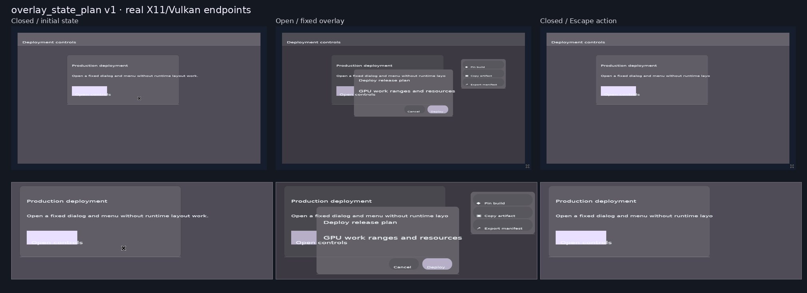

# Overlay State Plan v1 交付报告

**作者：** Manus AI
**状态：** 已完成实现、真实X11/Vulkan验收并可发布。
**范围：** Noir受限Material dialog/menu由静态构图升级为有限状态的可用overlay组件。

## 摘要

此前的Material dialog/menu已能作为编译期固定构图渲染，但没有可证明的open/close生命周期。`overlay_state_plan v1` 将可见性降级为严格的二元状态转换：Racket在宏展开期预分配全部surface、glyph、icon、rounded metadata与shadow layer；Rust在启动期验证固定动作、地址与tile范围；真实交互时仅将一个state slot写为`0`或`1`，并对26个quad、120个glyph以及对应shadow层执行固定alpha端点patch。

该实现不引入运行时overlay对象、动态layout、popup定位、资源查找、通用focus路由或通用动画系统。它保持Noir的核心规则：**运行时只执行编译器已计算和验证的最短可见性路径。**

## 交付内容

| 层 | 已交付内容 |
|---|---|
| Racket语言 | `material-overlay-state`、显式`overlay_state_required`、`overlay_state_plan v1` Scene ABI、固定state/action/event/quad/glyph/tile lowering。 |
| Rust宿主 | object-or-false反序列化、ABI门禁、startup proof、quad/glyph/shadow alpha执行表、hidden-event过滤与Escape关闭。 |
| GPU路径 | 44-byte quad实例的RGBA alpha patch；48-byte glyph placement末尾alpha lane；shadow vertex buffer增加`COPY_DST`且不改变实例ABI。 |
| 示例 | `material-overlay-showcase.rkt`：open、scrim、cancel、confirm、pin、copy、export的有限转换。 |
| 质量门禁 | Racket断言、Scene结构oracle、四类篡改拒绝、真实X11/Vulkan开关与rounded双应用兼容回归。 |
| 视觉证据 | 初始关闭、打开、Escape关闭真实帧和同场景三端点对照板。 |

## 固定执行模型

`deployment-overlay`的计划包含一个`overlay-visible`状态槽，初始值为`0`。`overlay-open`唯一写入`1`；`overlay-dismiss`、`overlay-confirm`、`overlay-pin`、`overlay-copy`与`overlay-export`只写入`0`。所有七个event slot、26个quad offset、120个glyph slot、相关shadow layer和tile `0`均由编译器固定。

| 运行时路径 | 固定工作 |
|---|---|
| Open | `set overlay-visible 1`、26个quad alpha恢复、120个glyph alpha恢复、对应shadow alpha恢复、tile 0。 |
| Escape | 选择已打开overlay的唯一已声明dismiss event，再走相同fixed close表。 |
| Scrim / cancel | literal close action、固定alpha归零和tile 0。 |
| Confirm / menu item | 已声明业务action的literal状态写入后，合并相同close alpha表与tile 0。 |

## 真实验证结果

真实X11/Vulkan回归在llvmpipe Vulkan环境中验证执行正确性，不将该环境的耗时用于物理GPU性能结论。打开后的宿主日志为：

```text
compiler overlay state: v1 entries=1 fixed-alpha-lanes=146 no-packets
overlay-state: id=deployment-overlay action=overlay-open visible=true \
  quad-alpha-patches=26 glyph-alpha-patches=120 tile-mask=0x1 worklist=no-packets
```

通过显式X11窗口焦点后，Escape产生`overlay-dismiss`、将state slot写回`0`并输出相同的固定alpha/tile路径。scrim、confirm与menu-copy也在真实窗口中依序完成关闭；窗口在所有转换后保持存活。

| 验证类别 | 结果 |
|---|---|
| Racket全量语言回归 | 通过。 |
| Rust 1.87 / wgpu 30 release build | 通过。 |
| Scene结构oracle | 通过。 |
| 真实open / Escape / scrim / confirm / menu-copy | 通过。 |
| `initial`、`offset`、`tile`、`disable`攻击 | 全部在GPU初始化前拒绝。 |
| rounded日志浏览器和实时监控表格回归 | 通过。 |

## 关键修复

实现中发现并修复了两个只有真实渲染才能暴露的问题。首先，initial hidden alpha先写入CPU实例副本、后创建GPU buffer会导致surface残留；现已在buffer创建后立即同步固定alpha端点。其次，overlay拥有的shadow instance buffer原来只有`VERTEX`使用权限；为执行已证明的alpha patch，buffer已增加`COPY_DST`。两项修复均不改变44-byte `QuadInstance` 或48-byte glyph placement ABI。

另一个兼容性问题是：普通桌面静态overlay不应被强制要求状态计划。为此Scene增加编译期`overlay_state_required`字段；只有`material-overlay-state`才导出true并启用disable门禁。这比依据generic primitive tag推断意图更精确。

## 视觉审阅



对照板显示初始关闭与Escape关闭仅保留基础工作区和open按钮；打开端点完整恢复固定scrim、dialog、menu、icon、圆角和shadow。基础工作区在三个端点中保持相同几何，证明状态转换未进入运行时layout路径。

## 边界与下一步

v1刻意限制为二元、预分配的overlay。它不支持多个并发modal、动态菜单坐标、焦点trap、自由淡入淡出、任意高度菜单、通用popover或运行时创建内容。这些应在未来以独立、可证明的计划形式扩展，而不应被一次性放入通用overlay对象。

最合适的下一项能力是 **modal focus subgraph v1**：当overlay打开时，Tab仅在预声明dialog/menu target中移动，关闭时恢复原焦点slot。其状态、边、恢复点和tile同样应在宏展开期冻结。

## References

[1] [Overlay State Plan v1 ABI](OVERLAY_STATE_PLAN_ABI_V1.md)
[2] [真实X11/Vulkan回归脚本](tools/verify_overlay_state_plan.sh)
[3] [三端点视觉对照](out/material-overlay-state-v1-comparison.png)
[4] [圆角兼容回归](tools/verify_rounded_surface_plan.sh)
