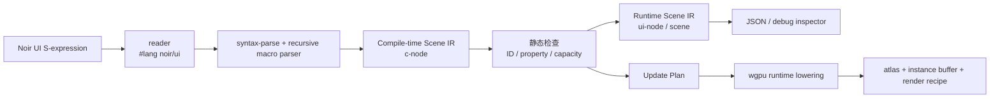

# `#lang noir/ui`：Racket 驱动的 Noir 极简布局 DSL

这是一个**可运行的最小语言包骨架**。它用 Racket 的 `#lang` 模块系统和 hygienic macro，在**宏展开期**把极简 UI 布局表单解析为 Noir Scene IR；运行期只得到普通数据结构和后端无关的 wgpu 更新计划。

它不是 wgpu renderer 的完整实现。它刻意完成更靠前、也更关键的一层：语言如何定义、语法如何诊断、静态/动态资源如何标记，以及怎样把 UI 输入降低为一个可供 Nelua/C/Rust runtime 执行的增量计划。

> reader 只负责定位语言；**宏才是 DSL parser**。不要在 reader 里直接做布局语义分析。

## 快速运行

沙箱已以 Racket 8.10 验证。为让 Racket 将当前目录视为 collection 根目录，执行：

```bash
cd noir-racket-ui
PLTCOLLECTS="$PWD:/usr/share/racket/collects" racket tests/run.rkt
```

正例会验证以下事实：dashboard 有 6 个节点、其中 1 个动态节点、动态文本预留 3 个 glyph slot，并生成一个 `glyph-patch` 更新步骤。负例 `tests/duplicate-id.rkt` 会在**宏展开期**报出带源位置的 duplicate-ID 错误。

## 真实 GPU 性能测量

当前仓库的 llvmpipe/Vulkan 数据用于验证编译期工作范围与回归协议，不能直接代表物理GPU性能。主线现在固定为Rust 1.87与wgpu 30；请先运行 `cargo run --release --manifest-path wgpu-verify/Cargo.toml --bin noir_wgpu_probe` 确认真实Vulkan适配器，再阅读 [真实 GPU 性能测量指南](REAL_GPU_BENCHMARKING.md)。WSL用户还应先执行 [`tools/diagnose_wsl_vulkan.sh`](tools/diagnose_wsl_vulkan.sh) 并遵循 [WSL / Dozen 诊断指南](WSL_DOZEN_GPU_DIAGNOSTICS.md)。

## 日志浏览器示例

[`examples/log-browser.rkt`](examples/log-browser.rkt) 是基于冻结列表交互ABI的第一个完整用户示例。它使用10,000条固定容量日志、四列 `LEVEL | TIME | SOURCE | MESSAGE` row template、有限level颜色、tail append、selection详情、scrollbar和 `PageUp`/`PageDown`/`Home`/`End`。日志详情和Enter激活仍然只走编译器已证明的局部tile与 `no-packets` worklist。

```bash
NOIR_ENTRY_MODULE=examples/log-browser.rkt PLTCOLLECTS="$PWD:" \
  racket tools/export-dashboard.rkt out/log-browser.scene.json
./tools/verify_log_browser.sh
```

该回归会在真实X11/Vulkan窗口中执行：离屏tail append → `End` → 选择 `ERROR` 行 → `Enter` 详情激活，同时拒绝被篡改的 `log_browser_plan` ABI。实现与完整验收记录见 [日志浏览器报告](LOG_BROWSER_REPORT.md) 和 [log-browser-plan v1](LOG_BROWSER_PLAN_ABI_V1.md)。

## 实时监控表格示例

[`examples/realtime-monitor.rkt`](examples/realtime-monitor.rkt) 是第二个完整用户示例。它复用冻结的虚拟列表与data-register ABI，提供10,000条逻辑容量、固定 `STATE | HOST | CPU | MEM | NET | LAT | JIT` 列、数字page 0/字母page 1动态glyph域、比例字体静态chrome、状态颜色、selected-row detail、scrollbar，以及 `PageUp`/`PageDown`/`Home`/`End`。

```bash
NOIR_ENTRY_MODULE=examples/realtime-monitor.rkt PLTCOLLECTS="$PWD:" \
  racket tools/export-dashboard.rkt out/realtime-monitor.scene.json
./tools/verify_realtime_monitor.sh
```

该回归同时证明：非法字符Scene篡改会被启动期glyph-domain proof拒绝；可见数据更新只写固定glyph地址；纯不可见记录只进入预分配arena，产生零glyph GPU写入和零render request。GPU replay策略图、原始时间戳数据及边界说明见[实时监控表格报告](REALTIME_MONITOR_TABLE_V1_REPORT.md)。

## 用户看到的语言

```racket
#lang noir/ui

(noir-app
 (column #:id dashboard #:gap 16 #:padding 24 #:background dark
   (text #:id title "NOIR GPU DASHBOARD")
   (row #:id metrics #:gap 12
     (text #:id fps #:dynamic frame-rate #:max-chars 3)
     (text #:id latency "ms"))
   (button #:id refresh "Refresh" #:on refresh-data)))
```

语法故意只有少数原语：`row`、`column`、`stack`、`grid`、`text`、`button` 和 `spacer`。容器支持 `#:gap`、`#:padding`、`#:width`、`#:height`、`#:grow`、`#:align`、`#:justify`、`#:clip`、`#:background`、`#:radius` 和 `#:opacity` 等小而受限的属性集合。

每个节点会获得稳定 ID。显式的 `#:id` 在整棵 UI 树中必须唯一；否则 compiler 在展开期报错。未写 ID 时，MVP 用 source position 生成默认 ID；生产版应将这一行为仅限开发模式，并要求可交互或可变节点显式 ID。

## 目录与职责

| 路径 | 作用 |
|---|---|
| `noir/ui/lang/reader.rkt` | `#lang noir/ui` 的 reader。仅把模块交给 `noir/ui/main`。 |
| `noir/ui/main.rkt` | 原语宏 parser、静态检查、Scene IR、JSON 导出和 wgpu-plan 降低接口。 |
| `examples/dashboard.rkt` | 成功编译的 DSL 示例。 |
| `examples/log-browser.rkt` | 10,000条固定容量日志浏览器：four-column row、tail append、详情与长列表交互。 |
| `examples/realtime-monitor.rkt` | 10,000条实时监控表格：数值data-register、可见性分流、状态色与比例字体chrome。 |
| `tools/verify_log_browser.sh` | 真实X11/Vulkan日志工作流与log-browser ABI篡改回归。 |
| `tools/verify_realtime_monitor.sh` | 实时监控表格的真实X11/Vulkan、glyph-domain篡改、可见性分流与键鼠回归。 |
| `tests/run.rkt` | Scene 预算、更新计划和 JSON 导出的断言。 |
| `tests/duplicate-id.rkt` | 失败样例；演示带源位置的宏诊断。 |

## 为什么 reader 要极薄

Racket 官方指南说明，`syntax/module-reader` 用于抽象新语言 reader 的通用部分；当表面语法仍是 S-expression 时，reader 只需指定 module language。[1] 这正适合 Noir 第一版：让 reader 将 `#lang noir/ui` 映射到 `noir/ui/main`；语法的结构、属性、源位置和错误信息留给宏系统处理。

如果未来要支持无括号的缩进语法、CSS-like literal 或颜色/单位字面量，再在 reader 中添加 `#:read-syntax` 和 readtable。**不要把 Scene IR construction 放进 reader**，否则会绕过模块展开、卫生宏和良好 IDE 错误上下文。

```racket
#lang s-exp syntax/module-reader
noir/ui/main
```

## 宏如何同时充当 parser 和 checker

`ui` 是唯一入口宏。它在展开期调用 `parse-node`，由 `syntax-parse` 先识别节点类别，再由小型 parser 读取关键字属性、孩子节点、静态文本和受许可动态文本。

Racket 的 `syntax-parse` 可以匹配 syntax object、字面量和 syntax class，并保留 syntax context；这使宏可以在语法位置直接抛出 `raise-syntax-error`。[2] 本骨架利用这一点做了四类检查：

| 展开期检查 | 失败条件 | 为什么必须在这里做 |
|---|---|---|
| 原语白名单 | 出现未知节点，例如 `progress-bar`。 | 防止 DSL 退化为任意 Racket widget API。 |
| 属性白名单 | 将 `#:gap` 用在 `text` 等不允许的位置。 | UI 语义必须有固定资源模型。 |
| 稳定 ID | 同一棵树重复 `#:id`。 | 运行时 patch/batch/resource 需要可追踪身份。 |
| 动态文本许可证 | `#:dynamic` 没有 `#:max-chars`。 | glyph atlas 与 instance buffer 需要可计算上界。 |

`text` 的语法是本路线的缩影：

```racket
(text #:id status "Ready")
(text #:id fps #:dynamic frame-rate #:max-chars 3)
```

静态文本可在 S1 中 shape/rasterize 进入 atlas；第二种形式只允许一个 identifier 和正整数的 `#:max-chars`。compiler 因此能生成：

```text
(glyph-patch fps 3)
```

它意味着某个状态改变最多更新 `fps` 的 3 个 glyph instance；并不表示运行时可以随意渲染任意长度字符串。

## 编译阶段与 IR



`c-node` 是宏展开期 IR，带有 `syntax` 源位置；`ui-node` 是运行时 IR，只保留 `tag`、稳定 `id`、已验证属性、子节点和 source。`scene` 额外含有如下 metadata：

- `static-node-count` 与 `dynamic-node-count`；
- `resource-budget`，目前包括 node、instance、glyph capacity；
- `update-plan`，目前包括动态 glyph patch 和几何 instance patch。

当前 `compile-scene->wgpu-plan` 只返回一个后端无关 hash。接入真正 wgpu runtime 时，应把这些数据降低为固定的 pipeline classes、atlas 分区、instance buffer slice、draw ranges 与 queue-write ranges；而不是在点击时创建 pipeline 或 bind group。

## 宏实现中的关键模式

```racket
(define-syntax (ui stx)
  (syntax-parse stx
    [(_ root:expr)
     (define-values (root-node _) (parse-node #'root (set)))
     (define-values (total dynamic budget updates)
       (compile-scene root-node))
     ...]))
```

`parse-node` 递归识别 `row`、`column`、`text` 等白名单原语；每个 parser 返回两个值：当前 `c-node` 与已经使用的 ID set。由于 set 在树遍历中向下传递，同级和跨分支 ID 冲突都会在展开期被发现。

最关键的设计不是宏本身，而是**不让宏直接生成一堆 wgpu 调用**。宏先生成稳定 IR 和计划；然后由独立后端对 IR 做 batch、atlas、clip、layout 和渲染降低。这样语言语义、性能检查、调试导出和多后端不会缠死在同一段宏代码里。

## 从这里继续的正确顺序

| 优先级 | 下一步 | 不应抢先做什么 |
|---|---|---|
| P1 | 给 `Scene IR` 增加 `rect`、`image`、`clip`、`transform`、`layer`。 | 立即写完整 CSS/Flexbox。 |
| P2 | 实现 `State IR` 与 `(action ...)`，将每个 action 降低为 State Patch。 | 允许任意 Racket callback 修改 scene。 |
| P3 | 实现静态 layout + 有界动态 axis；导出 damage/batch plan。 | 先做无界 list/repeater。 |
| P4 | 加入文本 shaping、glyph atlas、固定动态数字和 instance allocator。 | 将 `#:dynamic` 放宽成任意字符串。 |
| P5 | 写一个极小 `noir-wgpu` runtime：三条共享 pipeline（quad/glyph/image）与 preallocated buffer。 | 为每个 node 创建一条 WGSL/pipeline。 |
| P6 | 引入 `#%module-begin` 白名单与自定义 DrRacket tooling。 | 把全部 Racket API 当作用户 DSL 的一部分。 |

最后一点很重要：当前 MVP 为了测试方便 re-export 了 `racket/base`。生产版 `#lang noir/ui` 应自定义 `#%module-begin`，只允许 `noir-app`、`state`、`action`、`theme` 和受控 import 等顶层 form；普通 Racket 只能在显式的 `unsafe/host` 逃逸区使用。这样 Noir 才是一门能检查的 UI 语言，而不是“Racket 加几个函数”。

## 已验证的输出

```text
Noir UI language checks passed.
static nodes : 5
dynamic nodes: 1
resource budget: glyph_capacity = 3, instance_capacity = 6
(glyph-patch fps 3)
```

重复 ID 会得到：

```text
tests/duplicate-id.rkt:6:3: ui: duplicate stable UI id: repeated
in: (text #:id repeated "right")
```

## 参考资料

[1] [Racket Guide, *Using #lang s-exp syntax/module-reader*](https://docs.racket-lang.org/guide/syntax_module-reader.html)

[2] [Racket Documentation, *Parsing Syntax with syntax-parse*](https://docs.racket-lang.org/syntax/Parsing_Syntax.html)
