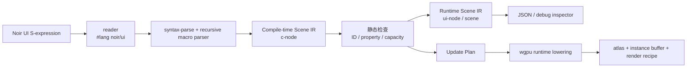

# `#lang noir/ui`：Racket 驱动的 Noir 极简布局 DSL

这是一个**可运行的最小语言包骨架**。它用 Racket 的 `#lang` 模块系统和 hygienic macro，在**宏展开期**把极简 UI 布局表单解析为 Noir Scene IR；运行期只得到普通数据结构和后端无关的 wgpu 更新计划。

它不是 wgpu renderer 的完整实现。它刻意完成更靠前、也更关键的一层：语言如何定义、语法如何诊断、静态/动态资源如何标记，以及怎样把 UI 输入降低为一个可供 Nelua/C/Rust runtime 执行的增量计划。

> reader 只负责定位语言；**宏才是 DSL parser**。不要在 reader 里直接做布局语义分析。

## 快速运行

沙箱已以 Racket 8.10 验证。为让 Racket 将当前目录视为 collection 根目录，执行：

```bash
cd noir-racket-ui
PLTCOLLECTS="$PWD:/usr/share/racket/collects" racket tests/run.rkt
```

正例会验证以下事实：dashboard 有 6 个节点、其中 1 个动态节点、动态文本预留 3 个 glyph slot，并生成一个 `glyph-patch` 更新步骤。负例 `tests/duplicate-id.rkt` 会在**宏展开期**报出带源位置的 duplicate-ID 错误。

## 真实 GPU 性能测量

当前仓库的 llvmpipe/Vulkan 数据用于验证编译期工作范围与回归协议，不能直接代表物理GPU性能。主线现在固定为Rust 1.87与wgpu 30；请先运行 `cargo run --release --manifest-path wgpu-verify/Cargo.toml --bin noir_wgpu_probe` 确认真实Vulkan适配器，再阅读 [真实 GPU 性能测量指南](REAL_GPU_BENCHMARKING.md)。WSL用户还应先执行 [`tools/diagnose_wsl_vulkan.sh`](tools/diagnose_wsl_vulkan.sh) 并遵循 [WSL / Dozen 诊断指南](WSL_DOZEN_GPU_DIAGNOSTICS.md)。

## 日志浏览器示例

[`examples/log-browser.rkt`](examples/log-browser.rkt) 是基于冻结列表交互ABI的第一个完整用户示例。它使用10,000条固定容量日志、四列 `LEVEL | TIME | SOURCE | MESSAGE` row template、有限level颜色、tail append、selection详情、scrollbar和 `PageUp`/`PageDown`/`Home`/`End`。日志详情和Enter激活仍然只走编译器已证明的局部tile与 `no-packets` worklist。

```bash
NOIR_ENTRY_MODULE=examples/log-browser.rkt PLTCOLLECTS="$PWD:" \
  racket tools/export-dashboard.rkt out/log-browser.scene.json
./tools/verify_log_browser.sh
```

该回归会在真实X11/Vulkan窗口中执行：离屏tail append → `End` → 选择 `ERROR` 行 → `Enter` 详情激活，同时拒绝被篡改的 `log_browser_plan` ABI。实现与完整验收记录见 [日志浏览器报告](LOG_BROWSER_REPORT.md) 和 [log-browser-plan v1](LOG_BROWSER_PLAN_ABI_V1.md)。

## 实时监控表格示例

[`examples/realtime-monitor.rkt`](examples/realtime-monitor.rkt) 是第二个完整用户示例。它复用冻结的虚拟列表与data-register ABI，提供10,000条逻辑容量、固定 `STATE | HOST | CPU | MEM | NET | LAT | JIT` 列、page 3受限tabular动态正文、page 2比例静态chrome、低压状态tint、selected-row detail、scrollbar，以及 `PageUp`/`PageDown`/`Home`/`End`。

```bash
NOIR_ENTRY_MODULE=examples/realtime-monitor.rkt PLTCOLLECTS="$PWD:" \
  racket tools/export-dashboard.rkt out/realtime-monitor.scene.json
./tools/verify_realtime_monitor.sh
```

该回归同时证明：非法字符Scene篡改会被启动期glyph-domain proof拒绝；可见数据更新只写固定glyph地址；纯不可见记录只进入预分配arena，产生零glyph GPU写入和零render request。GPU replay策略图、原始时间戳数据及边界说明见[实时监控表格报告](REALTIME_MONITOR_TABLE_V1_REPORT.md)。

## Dynamic Tabular Body Font v1（page 3）

[`noir-table-body-mono-16`](assets/fontc/noir-table-body-mono-16/) 使用DejaVu Sans Mono 16px、256×256 R8 atlas、37个封闭glyph（空格、`0–9`与`A–Z`）和固定10px advance。它已通过独立的`dynamic_font_cell_plan v1`接入**page 3**：日志浏览器与实时监控表格的固定data-register正文cell可在运行时只写一个已证明的glyph ID word。

face、page、UV、固定advance、quad、cell地址、tile、packet/worklist与bind group均在启动期或宏展开期固定；page 3不支持小写、标点、Unicode、比例动态run、输入编辑或任意详情文本。静态标题/列头继续使用page 2比例字体，legacy路径仍用于未声明tabular face的列表。

```bash
./tools/verify_tabular_body_font.sh
./tools/verify_dynamic_font_cell_plan.sh
```

第二个入口执行Racket导出、Rust 1.87 release、双应用真实X11/Vulkan page-3采样、face/UV/glyph-word-offset篡改拒绝、列表交互与可见性分流回归。完整ABI与交付记录见[Tabular Body Font Asset v1](TABULAR_BODY_FONT_ASSET_V1.md)、[Dynamic Font Cell Plan ABI v1](DYNAMIC_FONT_CELL_PLAN_ABI_V1.md)和[交付报告](DYNAMIC_FONT_CELL_PLAN_V1_REPORT.md)。

## 编译期桌面视觉语言 v2

Noir的视觉语言v2把EUI-NEO式桌面信息层级转译为可证明编译产物：固定品牌rail、page header、summary tiles、table card、detail card和主操作区。`(visual-preset desktop-wide)` 在宏展开期固定1280×720 canvas和32px margin；Racket以该唯一真值计算layout NDC、glyph bounds、tile、scroll scissor与scrollbar，Scene导出`noir-visual-language-plan-v1@1`。Rust在创建窗口前验证schema、preset、精确canvas和全部layout containment，再用同一尺寸配置window与offscreen canvas。

两个应用采用Neutral Ink语义色阶、raised surface、subtle/strong divider、低压WARN/ERROR tint、page 2比例静态chrome和page 3固定cell正文。颜色、elevation、font scale、文本inset和卡片几何均在宏展开期lower为固定RGBA、quad与glyph placement；运行时没有样式对象、theme查询、组件tag或reflow。

```bash
./tools/verify_visual_language.sh
```

该入口审计两个Scene的v2结构、canvas containment、primitive-only lowering和page分布，拒绝schema、preset和canvas尺寸篡改，并继续执行组件等价性、font placement、日志浏览器与实时监控表格的真实X11/Vulkan回归，且重新生成最终截图。完整设计、前后对照、proof与保留边界见[视觉语言规范](VISUAL_LANGUAGE_V2.md)和[交付报告](VISUAL_LANGUAGE_V2_REPORT.md)。

## 编译期 Rounded Surface v1（视觉渲染 v3）

视觉渲染v3第一部分为桌面chrome增加真实的 **SDF圆角与1px抗锯齿coverage**。`rounded_surface_plan v1` 在Racket宏展开期从显式 `#:radius` 的静态`stack`/`button`收集固定quad instance地址、精确几何和token半径，并导出`noir-rounded-surface-plan-v1@1`。Rust在创建窗口、pipeline和GPU资源之前反向验证schema、固定AA、44-byte instance对齐、ID/geometry一致性、唯一slot、tag白名单及`radius ≤ min(width,height)/2`，然后一次性上传只读metadata storage buffer。WGSL仅在相应静态quad slot执行rounded-rectangle SDF；未列入计划的slot仍走硬矩形路径。

这一能力不扩大44-byte `QuadInstance` ABI，也不改变glyph placement、虚拟列表row arena、state/action patch、tile/worklist或draw range。desktop-wide Scene 不能将nonempty计划篡改为`false`而静默降级；`radius`、`offset`、`geometry`和`disable`四类结构化攻击均在事件循环前被拒绝。

```bash
bash tools/verify_rounded_surface_plan.sh
```

该回归执行Racket测试、Rust 1.87/wgpu 30 release build、双应用Scene/视觉结构oracle、真实X11/Vulkan圆角帧、四类篡改拒绝，以及日志浏览器和实时监控表格的原有键鼠交互回归。设计契约与边界见[`rounded_surface_plan v1 ABI`](ROUNDED_SURFACE_PLAN_ABI_V1.md)，正式验收记录见[交付报告](ROUNDED_SURFACE_PLAN_V1_REPORT.md)；同一Scene geometry下的真实v2/v3对照为[日志浏览器](out/log-browser-rounded-v2-v3-comparison.png)与[实时监控表格](out/realtime-monitor-rounded-v2-v3-comparison.png)。

## 编译期 Shadow Surface v1（视觉渲染 v3）

`shadow_surface_plan v1` 将已解析的静态`elevation 1–5`降低为独立的、不可变的多层SDF shadow quad。Material level-1 card固定生成两层ambient shadow：外层`7px / 0.055`先绘制，内层`3px / 0.140`随后绘制。每层的expanded rect、source layout ID、44-byte source instance offset、radius、blur与opacity都由Racket在宏展开期确定；Rust在GPU resource创建前反向验证这些值与冻结layout及canonical recipe完全一致。

shadow使用独立只读metadata storage buffer和instance buffer，**不修改**44-byte `QuadInstance` ABI、glyph、列表ring、state/action patch、tile/worklist或runtime theme路径。完整静态canvas的固定顺序是root background、shadow layers、剩余static instance、glyph；因此opaque root不会覆盖阴影，source surface也会正确遮蔽自身内部的shadow。desktop-wide Scene不能将计划篡改为`false`；`blur`、`offset`、`geometry`与`disable`四类结构化攻击均在事件循环前拒绝。

```bash
bash tools/verify_shadow_surface_plan.sh
```

该入口复用Material真实X11/Vulkan按钮交互，并增加四类shadow攻击拒绝。正式合同见[`shadow_surface_plan v1 ABI`](SHADOW_SURFACE_PLAN_ABI_V1.md)，验收证据见[交付报告](SHADOW_SURFACE_PLAN_V1_REPORT.md)；同一真实场景的[before/after对照](out/material-profile-shadow-v1-comparison.png)与[最终截图](out/material-profile-dashboard-v1.png)可直接审阅。

## Material Profile v1

Noir 现在提供受限的 `(material-profile material-dark)`：它把Material Design 3的语义颜色、surface阶梯、shape、space/type、0–5 elevation token以及small app bar、card、filled button、navigation rail编译为已有的固定primitive Scene。profile仅在Racket宏展开期存在；Scene、Rust host与WGSL都不会持有或查询运行时Material theme对象。Material高层组件全部内联为`stack`、`surface`、`button`、`text`与`overlay`，因此不增加组件树、theme lookup、自由reflow或GPU ABI。

[`examples/material-profile-dashboard.rkt`](examples/material-profile-dashboard.rkt) 是完整桌面示例：1280×720固定Scene、3个静态rail destination、active pill、small app bar、三张rounded且level-1 shadow card和一个filled button。真实X11/Vulkan点击按钮只会触发预先确定的`material-refresh` action、一个state slot写入及3个glyph ID patch。

```bash
bash tools/verify_material_profile_v1.sh
```

该入口覆盖Racket全量回归、primitive-only Scene oracle、未声明active destination/错误destination数量/theme-profile混用三类宏展开拒绝、Rust 1.87/wgpu 30 build、真实X11/Vulkan渲染与按钮交互。规范、token映射、性能边界和官方资料见[Material Profile v1](MATERIAL_PROFILE_V1.md)及[交付报告](MATERIAL_PROFILE_V1_REPORT.md)；真实输出见[Material Profile截图](out/material-profile-dashboard-v1.png)。

page-2比例字体的glyph placement现使用共享typographic line top并仅应用一次manifest bearing：小写x-height、ascender和descender不再被强行顶边对齐。该修复不修改atlas、glyph ID、GPU ABI或运行时写入路径；详细数学、结构oracle、真实验证与前后对照见[Font Baseline Fix v1报告](FONT_BASELINE_FIX_V1_REPORT.md)及[真实帧对照](out/material-profile-baseline-before-after.png)。

## 受限Material交互组件批次 v1

`navigation_selection_plan v1` 将3–7个预声明rail destination降低为唯一状态槽、literal `set` action、透明固定event target、旧/新destination的两个RGBA patch与预证明tile范围。它不引入路由器、动态tab树或运行时layout；`literal`、source offset、tile范围和desktop禁用四类篡改都会在启动期拒绝。

`material-dialog`、`material-menu`、`material-menu-item`只生成固定scrim、预分配elevated surface、2–6个静态item、固定action与glyph placement。overlay示例同时验证`material-icon`的闭合八符号域：八枚Unicode symbol glyph在构建期扩展同一page-2 R8 atlas，保持原95个ASCII glyph ID稳定；运行时没有icon registry、SVG解析或资源查询。

`release_motion v1` 复用既有固定event端点，将每个允许event冻结为唯一的80ms ease-out轨道。宿主在release后只在预证明的instance位置、RGBA/position范围和tile mask内插值；duration、offset、damage和track缺失篡改均在GPU创建前拒绝。

`overlay_state_plan v1` 进一步让受限dialog/menu成为可开关组件：`material-overlay-state` 在展开期冻结一个0/1 state slot、唯一open action、有限close action、所有quad/glyph/shadow alpha地址以及唯一local tile。初始关闭、open、Escape、scrim、confirm与menu item关闭均只走这张固定转换表；运行时没有创建overlay、自由定位、reflow或通用弹层管理器。`initial`、`offset`、`tile`和`disable`篡改在启动期拒绝，且普通静态overlay不受状态计划门禁影响。

`modal_focus_subgraph v1` 将已打开overlay的键盘语义冻结为独立Scene计划：唯一open恢复event、2–6个字面声明顺序的Tab目标、canonical正/反向环、scrim pointer允许集与唯一local tile。打开后Tab/Shift+Tab只能访问该环，Enter只会激活当前固定close target，Escape沿既有close action关闭并恢复预声明open控制上下文；背景Focus Graph、列表与keyboard command路径不参与modal按键分发。该实现不搜索组件树，不做运行时focus discovery。

`material_observability_workbench_plan v2` 是框架级闭合工作台整合：一个Material rail降低为三个常驻alpha端点，并绑定两枚声明有序、互不别名的受限数据arena。Systems view复用10,000行/4物理槽arena；Alerts view新增独立2,048行/3物理槽incident arena；Overview不拥有任何数据arena。启动期反向证明rail配对、静态子树、instance/glyph/event/shadow地址、tile范围，以及每枚data-view与virtual-list、scrollbar、Page导航、log-browser、row activation的固定配对。运行时rail切换仍只写旧/新view的既定alpha地址；所有列表输入均由`list_index → owner_view_index`表门禁，因此Overview PageDown零数据写入，Systems和Alerts分别只消费自己的固定列表路径。

```bash
bash tools/verify_navigation_selection_plan.sh
bash tools/verify_material_dialog_menu_v1.sh
bash tools/verify_material_icon_assets_v1.sh
bash tools/verify_release_motion_v1.sh
bash tools/verify_overlay_state_plan.sh
bash tools/verify_modal_focus_subgraph_v1.sh
bash tools/verify_material_observability_workbench_plan_v2.sh
```

真实X11/Vulkan证据包括[导航Overview→Systems](out/material-profile-navigation-v1.scene.json)、[dialog/menu截图](out/material-overlay-showcase-v1.png)、[overlay状态三端点对照](out/material-overlay-state-v1-comparison.png)、[icon审阅记录](out/material_icon_visual_review.txt)、[release motion审阅记录](out/release_motion_visual_review.txt)与[workbench v2双arena截图](out/material-observability-workbench-v2-evidence/)。`overlay_state_plan v1`的完整合同与交付记录见[ABI规范](OVERLAY_STATE_PLAN_ABI_V1.md)和[交付报告](OVERLAY_STATE_PLAN_V1_REPORT.md)；modal焦点的固定状态机、攻击拒绝与真实键盘验证见[ABI规范](MODAL_FOCUS_SUBGRAPH_ABI_V1.md)和[交付报告](MODAL_FOCUS_SUBGRAPH_V1_REPORT.md)；workbench v2跨计划ABI、真实X11/Vulkan证据和攻击拒绝见[ABI规范](MATERIAL_OBSERVABILITY_WORKBENCH_PLAN_ABI_V2.md)和[交付报告](MATERIAL_OBSERVABILITY_WORKBENCH_PLAN_V2_REPORT.md)。

## 真实GPU组件性能矩阵 v1

新增运行器以当前Material dashboard与overlay Scene执行compiler-selected replay matrix。它会主动拒绝`llvmpipe`、`lavapipe`和CPU Vulkan设备；因此沙箱软件光栅化环境不会被误报为真实GPU结果。协议、硬件门禁和输出解释见[真实GPU组件矩阵说明](REAL_GPU_COMPONENT_MATRIX_V1.md)。

```bash
./tools/run_real_gpu_component_matrix_v1.sh
```

运行结束后，`tools/analyze_real_gpu_component_matrix_v1.py` 会生成按fixture/workload汇总的GPU中位数、P95、CPU提交时延、固定tile/glyph/write指标与图表。它只接受同一非CPU适配器、可用timestamp query及全部compiler-selected self-consistency proof为真的会话。

## 桌面组件宏 v1

Noir的`app-shell`、`surface`、`toolbar`、`table-header`、`status-pill`和`detail-panel`是**编译期语法压缩**，而不是运行时组件对象。宏展开后只剩已有的`column`、`stack`、`text`和`button`，并保留调用者明确给出的detail、button和label ID。因此已有state slot、font placement、event map、tile和worklist无需增加组件分支。

```bash
./tools/verify_desktop_component_macros.sh
```

该入口会比较手写primitive fixture与宏fixture的完整运行时Scene，并拒绝任何泄漏到Scene中的组件tag。两份完整应用也已经迁移到这一语法；详细规则、ID不变量和回归证据见[组件宏规范](DESKTOP_COMPONENT_MACROS_V1.md)与[交付报告](DESKTOP_COMPONENT_MACROS_V1_REPORT.md)。

## 用户看到的语言

```racket
#lang noir/ui

(noir-app
 (column #:id dashboard #:gap 16 #:padding 24 #:background dark
   (text #:id title "NOIR GPU DASHBOARD")
   (row #:id metrics #:gap 12
     (text #:id fps #:dynamic frame-rate #:max-chars 3)
     (text #:id latency "ms"))
   (button #:id refresh "Refresh" #:on refresh-data)))
```

语法故意只有少数原语：`row`、`column`、`stack`、`grid`、`text`、`button` 和 `spacer`。容器支持 `#:gap`、`#:padding`、`#:width`、`#:height`、`#:grow`、`#:align`、`#:justify`、`#:clip`、`#:background`、`#:radius` 和 `#:opacity` 等小而受限的属性集合。

每个节点会获得稳定 ID。显式的 `#:id` 在整棵 UI 树中必须唯一；否则 compiler 在展开期报错。未写 ID 时，MVP 用 source position 生成默认 ID；生产版应将这一行为仅限开发模式，并要求可交互或可变节点显式 ID。

## 目录与职责

| 路径 | 作用 |
|---|---|
| `noir/ui/lang/reader.rkt` | `#lang noir/ui` 的 reader。仅把模块交给 `noir/ui/main`。 |
| `noir/ui/main.rkt` | 原语宏 parser、静态检查、Scene IR、JSON 导出和 wgpu-plan 降低接口。 |
| `examples/dashboard.rkt` | 成功编译的 DSL 示例。 |
| `examples/log-browser.rkt` | 10,000条固定容量日志浏览器：four-column row、tail append、详情与长列表交互。 |
| `examples/realtime-monitor.rkt` | 10,000条实时监控表格：数值data-register、可见性分流、状态色与比例字体chrome。 |
| `examples/material-profile-dashboard.rkt` | Material Profile桌面示例：静态rail、navigation selection、closed-domain icon、small app bar、rounded/shadow card与fixed filled button。 |
| `examples/material-overlay-showcase.rkt` | 可开关的受限Material dialog/menu示例：固定scrim、dialog、menu、closed-domain icon、open/close状态转换、release motion、编译期modal Tab子图与预分配的圆角focus-ring。 |
| `examples/material-observability-workbench.rkt` | 框架级Material工作台：一个rail、三个常驻view端点、唯一10,000行Systems数据arena、detail panel、受限overlay与focus-ring。 |
| `tools/verify_log_browser.sh` | 真实X11/Vulkan日志工作流与log-browser ABI篡改回归。 |
| `tools/verify_realtime_monitor.sh` | 实时监控表格的真实X11/Vulkan、glyph-domain篡改、可见性分流与键鼠回归。 |
| `tools/verify_desktop_component_macros.sh` | 编译期组件宏与手写primitive Scene等价性回归。 |
| `tools/verify_visual_language.sh` | visual v2结构、canvas篡改、组件内联、字体与双应用真实X11/Vulkan回归，并生成最终截图。 |
| `tools/verify_visual_language_v2.py` | visual v2固定几何、primitive-only lowering、page分布与冻结列表ABI的Scene结构oracle。 |
| `tools/verify_rounded_surface_plan.sh` | rounded surface v1的Racket/Rust、双应用X11/Vulkan、四类篡改拒绝与交互全链回归。 |
| `tools/mutate_rounded_surface_scene.py` | 生成radius、offset、geometry和disable四类精确Scene攻击样本。 |
| `tools/verify_material_profile_v1.sh` | Material Profile v1的静态Scene oracle、宏输入拒绝、Rust构建与真实X11/Vulkan交互回归。 |
| `tools/verify_material_profile_v1.py` | Material Profile v1的primitive-only lowering、fixed canvas、rounded/shadow metadata、action/state/glyph结构oracle。 |
| `tools/verify_navigation_selection_plan.sh` | navigation selection v1的Racket/Rust、真实X11双destination切换与四类篡改拒绝回归。 |
| `tools/verify_material_dialog_menu_v1.sh` | 受限dialog/menu的宏拒绝、Scene oracle、真实X11 action与glyph patch回归。 |
| `tools/verify_material_icon_assets_v1.sh` | page-2 closed icon域的fontc确定性、非法icon拒绝、真实X11导航/menu回归。 |
| `tools/verify_release_motion_v1.sh` | 固定80ms release motion的结构、篡改拒绝与真实X11按下/复位回归。 |
| `tools/verify_overlay_state_plan.sh` | 受限dialog/menu的open、Escape、scrim、confirm/menu close、四类Scene篡改拒绝与真实X11/Vulkan回归。 |
| `tools/verify_overlay_state_plan.py` | overlay状态的0/1转换、固定alpha地址、glyph/shadow范围、事件和tile结构oracle。 |
| `tools/mutate_overlay_state_scene.py` | 生成initial、offset、tile和disable四类overlay状态攻击Scene。 |
| `tools/verify_modal_focus_subgraph_v1.sh` | modal焦点的Racket/Rust、真实X11 Tab/Shift+Tab/Enter/Escape、背景隔离和四类篡改拒绝回归。 |
| `tools/verify_modal_focus_subgraph_v1.py` | modal焦点恢复event、声明顺序Tab环、scrim允许集、背景隔离与local tile结构oracle。 |
| `tools/mutate_modal_focus_subgraph_scene.py` | 生成Tab边、允许event、tile与disable四类modal焦点攻击Scene。 |
| `tools/verify_modal_focus_visual_plan_v1.sh` | modal focus visual v1的一键Racket/Rust、Scene oracle、真实X11/Vulkan截图、Tab/Shift+Tab/Enter/Escape、四类篡改拒绝与rounded双应用兼容回归。 |
| `tools/verify_modal_focus_visual_plan_v1.py` | 固定focus-ring条目、event slot、44-byte源地址、halo几何、SDF配方与tile范围的Scene结构oracle。 |
| `tools/mutate_modal_focus_visual_scene.py` | 生成source、geometry、tile和disable四类focus视觉攻击Scene。 |
| `tools/verify_material_observability_workbench_plan_v1.sh` | 历史workbench v1单Systems数据arena的一键回归。 |
| `tools/verify_material_observability_workbench_plan_v2.sh` | workbench v2双arena的一键语言/Scene/Rust/真实X11-Vulkan、Overview输入门禁、Systems/Alerts独立列表、focus-ring、四类篡改拒绝与rounded兼容回归。 |
| `tools/verify_material_observability_workbench_plan_v2.py` | v2三view端点、两枚data-view容量/owner/辅助计划配对、资源地址隔离与overlay焦点组合结构oracle。 |
| `tools/mutate_material_observability_workbench_v2_scene.py` | 生成第二数据arena的instance地址、owner子树、tile范围和required禁用四类攻击Scene。 |
| `MATERIAL_OBSERVABILITY_WORKBENCH_PLAN_ABI_V2.md` | v2双data-view Scene ABI、启动proof、owner-view输入门禁、固定alpha写集与非目标边界。 |
| `MATERIAL_OBSERVABILITY_WORKBENCH_PLAN_V2_REPORT.md` | v2双arena交付结果、真实X11/Vulkan截图、篡改拒绝与rounded兼容报告。 |
| `WORKBENCH_CROSS_VIEW_TRANSACTION_PLAN_ABI_V1.md` | Alerts→Overview确认事务ABI：Racket lowering、Rust schema/required gate、workbench关联proof与固定state/GPU patch执行器。 |
| `WORKBENCH_CROSS_VIEW_TRANSACTION_PLAN_V1_REPORT.md` | 固定执行器交付报告：1 state + 1 color + 29 detail glyph + 8 Overview glyph的闭合写集、真实X11/Vulkan与零写入门禁证据。 |
| `tools/verify_workbench_cross_view_transaction_abi_gate_v1.sh` | 跨视图事务v1的Racket导出、Rust release、真实X11/Vulkan启动proof与ABI/disable/action/target四类Scene拒绝回归。 |
| `tools/verify_workbench_cross_view_transaction_executor_v1.sh` | 跨视图事务固定执行器一键回归：合法确认、无选中零写入、非活动view零写入、截图、ABI攻击拒绝与rounded兼容。 |
| `tools/mutate_workbench_cross_view_transaction_scene.py` | 生成跨视图事务ABI合同、required禁用、action slot与Overview目标glyph四类攻击Scene。 |
| `MODAL_FOCUS_VISUAL_PLAN_ABI_V1.md` | 预分配modal focus ring的Scene ABI、启动期proof、GPU metadata与固定alpha写集规范。 |
| `MODAL_FOCUS_VISUAL_PLAN_V1_REPORT.md` | focus视觉交付结果、真实X11/Vulkan截图证据、篡改拒绝与兼容回归报告。 |
| `tools/make_overlay_state_v1_comparison.py` | 将关闭、打开与Escape关闭的真实X11/Vulkan端点生成审阅对照板。 |
| `tools/run_real_gpu_component_matrix_v1.sh` | 拒绝CPU Vulkan后采集Material dashboard/overlay compiler-selected GPU timestamp矩阵。 |
| `tools/analyze_real_gpu_component_matrix_v1.py` | 审计真实GPU矩阵的适配器一致性、timestamp/self-consistency门禁并生成汇总与图表。 |
| `tools/verify_shadow_surface_plan.sh` | shadow surface v1正向Material X11/Vulkan路径与blur/offset/geometry/disable攻击拒绝回归。 |
| `tools/mutate_shadow_surface_scene.py` | 生成shadow recipe、source地址、扩展几何与禁用攻击Scene。 |
| `tools/make_shadow_surface_v1_comparison.py` | 将无shadow发布帧与当前真实X11/Vulkan帧生成确定性before/after审阅板。 |
| `tools/make_font_baseline_comparison.py` | 从修复前后真实X11/Vulkan帧生成page-2小写baseline对照图。 |
| `tools/make_visual_language_v2_comparison.py` | 从同分辨率真实帧确定性生成视觉v1/v2前后对照图。 |
| `tools/make_rounded_surface_v3_comparison.py` | 从同分辨率真实帧确定性生成rounded surface v2/v3前后对照图。 |
| `tools/verify_tabular_body_font.sh` | 受限tabular正文face的确定性、闭域、固定advance与语料覆盖回归。 |
| `tools/verify_dynamic_font_cell_plan.sh` | page-3动态cell的Racket/Rust/X11正向路径、face/UV/word-offset拒绝与两应用交互回归。 |
| `tools/audit_visual_canvas.py` | 对visual_language_plan将NDC反算为像素rect并审计layout containment。 |
| `tests/run.rkt` | Scene 预算、更新计划和 JSON 导出的断言。 |
| `tests/duplicate-id.rkt` | 失败样例；演示带源位置的宏诊断。 |

## 为什么 reader 要极薄

Racket 官方指南说明，`syntax/module-reader` 用于抽象新语言 reader 的通用部分；当表面语法仍是 S-expression 时，reader 只需指定 module language。[1] 这正适合 Noir 第一版：让 reader 将 `#lang noir/ui` 映射到 `noir/ui/main`；语法的结构、属性、源位置和错误信息留给宏系统处理。

如果未来要支持无括号的缩进语法、CSS-like literal 或颜色/单位字面量，再在 reader 中添加 `#:read-syntax` 和 readtable。**不要把 Scene IR construction 放进 reader**，否则会绕过模块展开、卫生宏和良好 IDE 错误上下文。

```racket
#lang s-exp syntax/module-reader
noir/ui/main
```

## 宏如何同时充当 parser 和 checker

`ui` 是唯一入口宏。它在展开期调用 `parse-node`，由 `syntax-parse` 先识别节点类别，再由小型 parser 读取关键字属性、孩子节点、静态文本和受许可动态文本。

Racket 的 `syntax-parse` 可以匹配 syntax object、字面量和 syntax class，并保留 syntax context；这使宏可以在语法位置直接抛出 `raise-syntax-error`。[2] 本骨架利用这一点做了四类检查：

| 展开期检查 | 失败条件 | 为什么必须在这里做 |
|---|---|---|
| 原语白名单 | 出现未知节点，例如 `progress-bar`。 | 防止 DSL 退化为任意 Racket widget API。 |
| 属性白名单 | 将 `#:gap` 用在 `text` 等不允许的位置。 | UI 语义必须有固定资源模型。 |
| 稳定 ID | 同一棵树重复 `#:id`。 | 运行时 patch/batch/resource 需要可追踪身份。 |
| 动态文本许可证 | `#:dynamic` 没有 `#:max-chars`。 | glyph atlas 与 instance buffer 需要可计算上界。 |

`text` 的语法是本路线的缩影：

```racket
(text #:id status "Ready")
(text #:id fps #:dynamic frame-rate #:max-chars 3)
```

静态文本可在 S1 中 shape/rasterize 进入 atlas；第二种形式只允许一个 identifier 和正整数的 `#:max-chars`。compiler 因此能生成：

```text
(glyph-patch fps 3)
```

它意味着某个状态改变最多更新 `fps` 的 3 个 glyph instance；并不表示运行时可以随意渲染任意长度字符串。

## 编译阶段与 IR



`c-node` 是宏展开期 IR，带有 `syntax` 源位置；`ui-node` 是运行时 IR，只保留 `tag`、稳定 `id`、已验证属性、子节点和 source。`scene` 额外含有如下 metadata：

- `static-node-count` 与 `dynamic-node-count`；
- `resource-budget`，目前包括 node、instance、glyph capacity；
- `update-plan`，目前包括动态 glyph patch 和几何 instance patch。

当前 `compile-scene->wgpu-plan` 只返回一个后端无关 hash。接入真正 wgpu runtime 时，应把这些数据降低为固定的 pipeline classes、atlas 分区、instance buffer slice、draw ranges 与 queue-write ranges；而不是在点击时创建 pipeline 或 bind group。

## 宏实现中的关键模式

```racket
(define-syntax (ui stx)
  (syntax-parse stx
    [(_ root:expr)
     (define-values (root-node _) (parse-node #'root (set)))
     (define-values (total dynamic budget updates)
       (compile-scene root-node))
     ...]))
```

`parse-node` 递归识别 `row`、`column`、`text` 等白名单原语；每个 parser 返回两个值：当前 `c-node` 与已经使用的 ID set。由于 set 在树遍历中向下传递，同级和跨分支 ID 冲突都会在展开期被发现。

最关键的设计不是宏本身，而是**不让宏直接生成一堆 wgpu 调用**。宏先生成稳定 IR 和计划；然后由独立后端对 IR 做 batch、atlas、clip、layout 和渲染降低。这样语言语义、性能检查、调试导出和多后端不会缠死在同一段宏代码里。

## 从这里继续的正确顺序

| 优先级 | 下一步 | 不应抢先做什么 |
|---|---|---|
| P1 | 给 `Scene IR` 增加 `rect`、`image`、`clip`、`transform`、`layer`。 | 立即写完整 CSS/Flexbox。 |
| P2 | 实现 `State IR` 与 `(action ...)`，将每个 action 降低为 State Patch。 | 允许任意 Racket callback 修改 scene。 |
| P3 | 实现静态 layout + 有界动态 axis；导出 damage/batch plan。 | 先做无界 list/repeater。 |
| P4 | 加入文本 shaping、glyph atlas、固定动态数字和 instance allocator。 | 将 `#:dynamic` 放宽成任意字符串。 |
| P5 | 写一个极小 `noir-wgpu` runtime：三条共享 pipeline（quad/glyph/image）与 preallocated buffer。 | 为每个 node 创建一条 WGSL/pipeline。 |
| P6 | 引入 `#%module-begin` 白名单与自定义 DrRacket tooling。 | 把全部 Racket API 当作用户 DSL 的一部分。 |

最后一点很重要：当前 MVP 为了测试方便 re-export 了 `racket/base`。生产版 `#lang noir/ui` 应自定义 `#%module-begin`，只允许 `noir-app`、`state`、`action`、`theme` 和受控 import 等顶层 form；普通 Racket 只能在显式的 `unsafe/host` 逃逸区使用。这样 Noir 才是一门能检查的 UI 语言，而不是“Racket 加几个函数”。

## 已验证的输出

```text
Noir UI language checks passed.
static nodes : 5
dynamic nodes: 1
resource budget: glyph_capacity = 3, instance_capacity = 6
(glyph-patch fps 3)
```

重复 ID 会得到：

```text
tests/duplicate-id.rkt:6:3: ui: duplicate stable UI id: repeated
in: (text #:id repeated "right")
```

## 参考资料

[1] [Racket Guide, *Using #lang s-exp syntax/module-reader*](https://docs.racket-lang.org/guide/syntax_module-reader.html)

[2] [Racket Documentation, *Parsing Syntax with syntax-parse*](https://docs.racket-lang.org/syntax/Parsing_Syntax.html)
