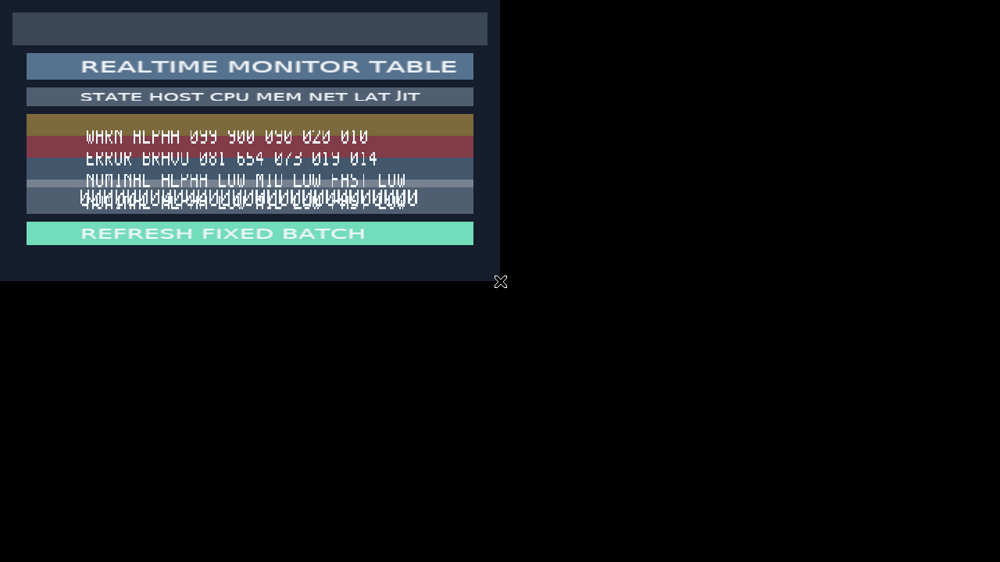
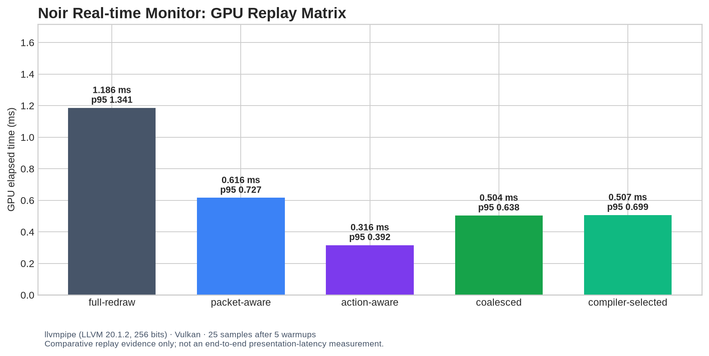

# Noir 实时监控表格 v1 交付报告

**作者：Manus AI**  
**范围：第二个用户可见Noir桌面应用**

## 成果概览

`examples/realtime-monitor.rkt` 将 Noir 已冻结的长列表、数据批更新、列表交互、行动槽、比例字体与Scene proof组合为一个实时监控表格。它不是新的运行时表格实现，而是既有编译产物的纯消费者：宏展开期确定列头、行几何、10,000条逻辑容量、四个物理row slot、字形地址、row颜色地址、滚动转换、详情glyph范围和激活batch；运行时只选择固定更新范围。

真实X11/Vulkan截图表明，静态标题、列头与刷新文案使用fontc page-2 DejaVu Sans比例字体；实时行记录中的字母与数字使用既有page-1/page-0 legacy atlas。首帧可见`WARN ALPHA 099 900 090 020 010`和`ERROR BRAVO 081 654 073 019 014`，证实数据寄存器glyph ID写入已实际影响着色器采样，而非仅停留在CPU日志。

| 项目 | 固定编译产物 / 运行时边界 |
|---|---|
| 表格容量 | 10,000逻辑行、4物理row slot、3可见行 |
| 数据记录 | 固定36字符compact register；大写ASCII、空格及数字均在编译期允许域内 |
| 动态字形 | 无state的可变placement只允许属于已验证data-register row slot，初始page 1且无font face；运行时可按字符规则写page 0数字或page 1字母 |
| 静态chrome | title、column header和refresh label使用经`font_placement_plan v1`验证的page-2比例字形 |
| 状态颜色 | `WARN`、`ERROR`、`DEBUG`等首字段经已存在的row color固定offset更新 |
| 行详情与激活 | End → row 9998 → selection/detail → Enter复用`row_activation_plan v1`和coalesced action batch |

## 可见性分流证据

Scene内的`bootstrap-telemetry`包含三条编译期声明记录：两条位于初始视口，一条位于逻辑行5000。真实宿主日志显示该批次仅写入68个glyph ID word；随后注入的两条更新中仅逻辑行0可见，因而仅写入34个glyph ID word，逻辑行7000只更新固定CPU arena且不提交glyph GPU write或render request。

| 批次 | 记录数 | 可见记录 | arena-only记录 | glyph ID GPU写入 | render request |
|---|---:|---:|---:|---:|---|
| `bootstrap-telemetry` | 3 | 2 | 1 | 68 words | 是 |
| 注入刷新批次 | 2 | 1 | 1 | 34 words | 是 |
| 纯不可见记录 | 1 | 0 | 1 | 0 words | 否 |

这验证了Noir的关键路径不是“更新数据后重绘列表”，而是**根据编译期固定的row ring与viewport关系仅写入当前可见行的glyph地址**。

## 启动期proof与回归

`tools/verify_realtime_monitor.sh` 以单命令验证Racket回归、Scene导出、Rust 1.87 release构建、非法小写glyph篡改拒绝、真实X11/Vulkan截图、可见性分流和真实End/鼠标/Enter交互。非法Scene将bootstrap记录中的`WARN`改为`Warn`后，在首帧前被固定legacy glyph domain/width proof拒绝。

同时已重跑并通过既有`tools/verify_font_placement_scene.sh`和`tools/verify_log_browser.sh`，因此page-2比例字体接入与原有日志浏览器均保持兼容。

## GPU Replay Matrix

GPU replay matrix测量`coalesced-activate-refresh-telemetry`的激活路径。compiler-selected在没有新鲜校准artifact时明确选择编译期canonical `coalesced` fallback，而非运行时自适应；proof winner、执行器、tile mask、draw、glyph实例和140-byte winner write均一致。

| 策略 | GPU中位数 | GPU p95 | Tile | Draw | Glyph实例 |
|---|---:|---:|---:|---:|---:|
| full-redraw | 1.186 ms | 1.341 ms | 1 | 4 | 236 |
| packet-aware | 0.616 ms | 0.727 ms | 3 | 2 | 48 |
| action-aware | 0.316 ms | 0.392 ms | 1 | 1 | 29 |
| coalesced | 0.504 ms | 0.638 ms | 2 | 2 | 48 |
| compiler-selected | 0.507 ms | 0.699 ms | 2 | 2 | 48 |

`compiler-selected`相对全量重绘的GPU中位数改善为**57.25%**。该数据来自llvmpipe Vulkan、5次预热后25个timestamp样本，说明当前编译选择、局部tile提交和实际执行器一致；它**不是**AMD 780M Dozen硬件数据，也不是input-to-photon或通用桌面性能声明。完整字段见 [Replay Matrix 原始数据](out/realtime-monitor-replay-matrix.json) 与 [结构化摘要](out/REALTIME_MONITOR_REPLAY_SUMMARY.md)。

## 下一步

第二个示例验证完成后，应抽取两个应用已共同使用的静态chrome模式：`app-shell`、`surface`、`toolbar`、`table-header`、`status-pill`和`detail-panel`。这些组件宏必须继续lower为现有primitive、字体placement、固定glyph address、tile和worklist计划，而不是重新引入运行时组件树解释。
