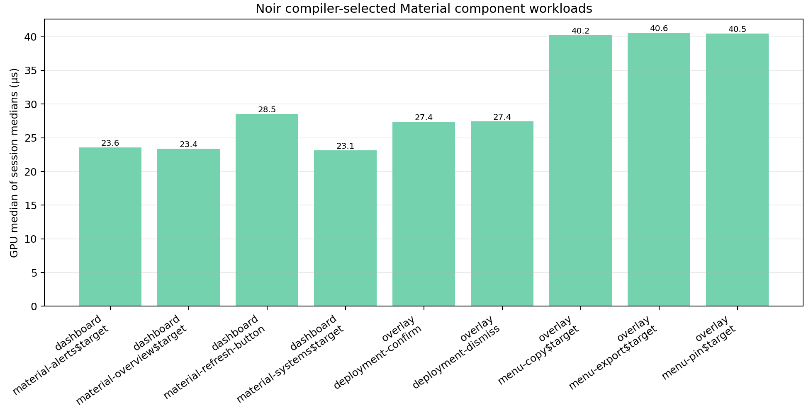

# Noir Material Component Matrix v1：AMD Radeon 780M Smoke Report

**作者：** Manus AI
**测量提交：** `958b224f7f117bf52f50ac3227a72e047222c88d`
**数据提交：** `6a01b1a6a9e240c2b22a961adfb3bf83dae4643a`
**结论等级：** 真实GPU路径已验证；这是 **2会话 smoke measurement**，并非具有统计充分性的最终性能研究。

## 摘要

本次测量确认，Noir 新增的 navigation selection、受限 dialog/menu、闭合 icon atlas 与 release motion 所形成的九条 compiler-selected 组件路径，已在 AMD Radeon 780M 的 Vulkan/Dozen 环境中使用 GPU timestamp query 实际执行。所有 compiler-selected proof 均为自一致，且宿主报告的实际选中适配器是 `Microsoft Direct3D12 (AMD RadeonT 780M)`；虽然同一系统也枚举到 llvmpipe CPU 设备，实际 replay matrix 并未选择它。[1] [2]

GPU“各会话中位数的中位数”为 **23.12–40.62 µs**，而 CPU event-to-submit 中位数为 **152.92–175.93 µs**。这支持一个有限但重要的结论：在这些已编译、局部重绘的组件操作中，GPU执行不是当前主导成本；宿主侧事件、命令编码与提交路径更大。它**不**代表端到端用户感知延迟，也不构成与GPUI或其他框架的性能比较。

## 测量有效性与范围

运行manifest记录了两个独立会话、每条replay row五次warm-up和二十个时间戳样本。每个 session 分别运行 dashboard 和 overlay；两类fixture的顺序在会话内随机化。四份原始replay matrix 均声明 `timestamp_query_supported: true`，每份包含预期的 compiler-selected rows，且所有 `self_consistent` 字段均为真。[1] [3]

| 验证维度 | 观察结果 | 解释 |
|---|---|---|
| 选中适配器 | AMD Radeon 780M，经 Direct3D12/Dozen 暴露为 Vulkan | 真实集成GPU路径，而非llvmpipe。 |
| timestamp query | 4/4 matrix 支持 | GPU数值来自时间戳查询，而不是CPU墙钟替代。 |
| compiler proof | 9/9 workload、4/4 matrix 自一致 | tile、glyph与winner write统计与编译器计划相符。 |
| 会话规模 | 2 | 足以做smoke验收，不足以估计稳定置信区间或显著性。 |
| 样本规模 | 每row 20次、每workload跨2会话 | 同会话样本相关，不能将40次观察视为40个独立机器实验。 |

> 系统Vulkan枚举同时含有集成GPU与llvmpipe CPU设备。因此，本报告以 **host replay matrix的adapter_name** 为准，而非只凭系统中“存在GPU”作判断。[2] [3]

## 逐项结果

下表中的GPU数值是两个session中位数的中位数；GPU P95取两个session P95中的较高值。CPU列是event-to-submit中位数，涵盖主机侧执行与命令提交，但不等待GPU完成或显示器呈现。[3]

| Fixture | Compiler-selected workload | GPU median (µs) | GPU P95 (µs) | CPU submit median (µs) | Tiles | Glyph draws / instances | Winner writes |
|---|---|---:|---:|---:|---:|---:|---:|
| Dashboard | Alerts selection | 23.56 | 26.80 | 157.02 | 1 | 1 / 7 | 24 B |
| Dashboard | Overview selection | 23.40 | 26.48 | 175.93 | 1 | 1 / 9 | 24 B |
| Dashboard | Refresh button | 28.52 | 30.04 | 175.72 | 2 | 2 / 10 | 36 B |
| Dashboard | Systems selection | 23.12 | 26.72 | 152.92 | 1 | 1 / 8 | 24 B |
| Overlay | Deployment confirm | 27.40 | 28.96 | 171.41 | 2 | 2 / 8 | 32 B |
| Overlay | Deployment dismiss | 27.42 | 28.04 | 175.46 | 2 | 2 / 8 | 32 B |
| Overlay | Menu copy | 40.22 | 41.36 | 175.09 | 2 | 2 / 42 | 32 B |
| Overlay | Menu export | 40.62 | 41.48 | 171.52 | 2 | 2 / 42 | 32 B |
| Overlay | Menu pin | 40.48 | 41.56 | 175.72 | 2 | 2 / 42 | 32 B |

## 解释

### 1. Navigation selection 是预期中的最低成本交互路径

三个destination选择路径稳定落在 **23.12–23.56 µs**。它们只重绘一个预证明tile、提交一个glyph draw、处理7–9个glyph instance，并写入24字节winner writes。Refresh需要两个tile、两个draw、10个instance和36字节，因此GPU中位数比三个navigation路径的平均值高 **22.09%**；这一差异符合编译器导出的工作量，而不是运行时组件查找或layout的迹象。[3] [4]

### 2. Menu路径的额外GPU时间可由固定glyph工作量解释

deployment confirm/dismiss 的平均GPU中位数是 **27.41 µs**；三个menu操作的平均值是 **40.44 µs**，高 **47.54%**。两类路径同为两个tile、两个glyph draw和32字节winner writes，但menu tile要提交 **42个glyph instance**，而deployment操作只有8个。这是当前最直接的结构性解释：成本来自已编译的受影响静态文本范围，而非图标注册、动态菜单layout、字符串shaping或通用动画对象。[3] [4]

这不是缺陷证据。40.62 µs仍为0.041 ms；但是它给出了下一轮优化的明确对象：若menu交互需要更低成本，应让compiler进一步缩小menu item的tile/glyph draw range，而不是在运行时微调颜色或复用组件对象。

### 3. 当前瓶颈更偏向CPU提交而非GPU执行

九条路径的 CPU/GPU 中位数比值为 **4.22×–7.52×**。因此用户摘要中的“约6–7倍”可作为部署与导航路径的近似，但对menu路径并不准确：menu为 **4.22×–4.35×**，因为其GPU glyph范围更大。CPU列不是端到端输入延迟，不能据此宣称“CPU成为最终用户延迟瓶颈”；可以确认的只是，在该测量边界内，主机event-to-submit开销大于单次GPU replay执行时间。[4]

### 4. 稳定性有积极信号，但样本仍不足

menu三条路径的两会话中位数差为 **0.79%–1.50%**，deployment为 **0.73%–0.88%**；这对较重overlay路径是好的smoke信号。三个navigation路径的会话中位数差较大，为 **21.46%–27.18%**，但其绝对GPU时间只有约23 µs，极易受到集成GPU频率、Windows/WSL调度、Dozen实现和测量量化的影响。最大P95相对中位数的余量为 **15.57%**。两会话不足以判断这些变化是稳定架构效应还是环境噪声。[4]

## 可以与不能作出的结论

| 可以作出的结论 | 现在不能作出的结论 |
|---|---|
| 新组件在AMD 780M真实GPU上执行了compiler-selected局部重绘路径。 | Noir相对GPUI、Flutter、Qt或其他框架更快。 |
| GPU timestamp work落在23–41 µs范围，且所有proof自一致。 | 真实用户端到端点击延迟为23–41 µs。 |
| menu较慢与其42个固定glyph instance工作量一致。 | 菜单实现存在算法瓶颈或必然需要优化。 |
| winner writes保持24–36字节，验证运行时写入范围小且固定。 | 该数值对任意Noir应用、任何GPU或所有驱动版本都成立。 |

## 后续实验建议

正式报告前，应在同一机器上完成默认 **5会话 × 25 warm-up × 100 samples** 的组件矩阵。随后可再运行独立的交叉框架配对协议：必须固定工作负载语义、窗口和显示后端、输入坐标、warm-up、随机区组、二进制哈希、功耗/驱动状态与完整性阈值；其结论不能从本组件矩阵外推。

对于Noir自身的后续优化，优先级应是将menu item交互的受影响glyph范围从42进一步切分，而非扩展运行时UI抽象。对navigation和deployment路径而言，继续压低GPU时间的收益可能很小；更值得测量的是CPU事件到提交、GPU队列、present和显示路径的分段时间。

## References

[1] [Run manifest — AMD 780M smoke protocol](data/material-component-gpu-smoke/run-manifest.json)
[2] [Vulkan adapter summary — Dozen GPU and llvmpipe enumeration](data/material-component-gpu-smoke/vulkaninfo-summary.txt)
[3] [Raw session replay matrices](data/material-component-gpu-smoke/)
[4] [Derived component inspection](data/material-component-gpu-smoke/component-gpu-inspection.json)
