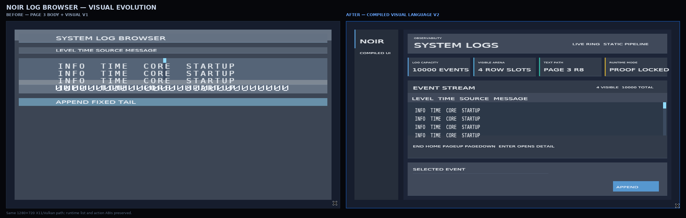
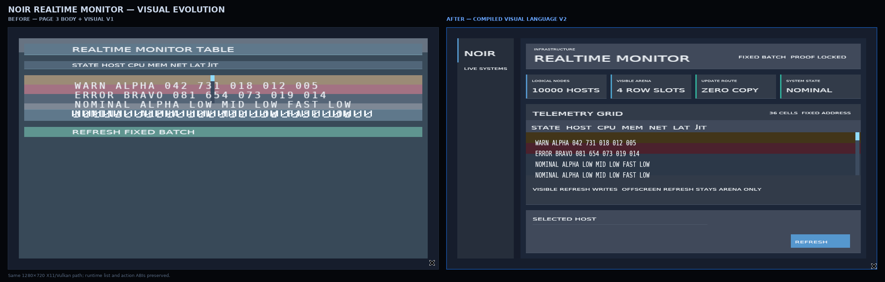

# Noir 编译期桌面视觉语言 v2：交付报告

**作者：Manus AI**
**状态：已在日志浏览器与实时监控表格落地，并经真实 X11/Vulkan 回归验证。**



## 摘要

Noir 视觉语言 v2 的目标不是把运行时样式系统搬入编译器，而是把高质量桌面界面所需的**信息层级、空间节奏、surface 阶梯、文本尺度、状态色与组件变体**全部收敛为可编译的固定几何与RGBA常量。设计研究参考了 EUI-NEO 的深色信息面板、卡片分组、克制状态色和紧凑操作区等可迁移原则，但没有复刻其实现或引入其运行时模型。[1]

该版本将 Noir 的两个真实应用从“证明渲染路径可用的工程界面”重构为一致的桌面工作台：固定品牌rail、页面header、summary tiles、table card、context/detail card 与主操作区域。页面布局、字体scale、卡片坐标、边界线、颜色和clip范围在Racket宏展开期固定；Rust只接受已版本化的`visual_language_plan v1`，在创建窗口前拒绝任何不符合画布合同的Scene。

| 交付项 | v2结果 |
|---|---|
| 编译期画布 | `desktop-wide`，`1280×720`，`32px` margin |
| 视觉语言资产 | v2语义色、space、radius、elevation与静态font-scale均在宏展开期折叠 |
| 页面结构 | workspace rail、page header、4个metric tile、table card、detail card、主操作区 |
| 正文字体 | page 3 `noir-table-body-mono-16`，固定10px advance、固定cell地址 |
| 静态chrome字体 | page 2 `noir-desktop-sans-18`，比例灰度字体与编译期placement |
| 运行时样式成本 | 0次theme查询、0个组件对象、0次runtime reflow、0个样式字符串解释 |

## 从参考研究到Noir可编译规则

EUI-NEO 的界面并非单靠颜色显得精致；其可迁移价值在于把品牌导航、页面标题、摘要数据、主要工作区与上下文操作区分成稳定而低噪声的层级，并使用克制的surface差异和有限状态色维持数据优先级。[1] Noir v2 将这些原则翻译为确定性规则，而不是将它们留作主观样式建议。

| 参考原则 | Noir v2固定实现 | 禁止的运行时机制 |
|---|---|---|
| 品牌与工作区分层 | 168px固定rail；996px固定workspace | 根据内容重排的sidebar |
| 页面层级 | eyebrow、title、meta使用封闭font-scale | 运行时字体测量或字号查询 |
| 摘要优先 | 四个240px metric tile，单侧accent条 | 可变数量卡片或自适应网格 |
| 数据工作区 | 996×300 table card；36px column band；4×32 viewport | 根据数据量自动扩张表格 |
| 上下文操作 | 996×128 detail card；固定主按钮坐标 | 运行时popover或浮动布局 |
| 状态表达 | success/warning/danger/info低压tint | 将整行替换为高亮警报色 |

## 可证明的视觉产物

### 1. 版本化画布合同

每个视觉v2 Scene都输出`visual_language_plan`。其`abi_schema`为`noir-visual-language-plan-v1`、`preset`为`desktop-wide`，且canvas必须精确等于`1280×720`和`32px margin`。Rust在任何窗口、surface或GPU资源创建前验证这一合同；schema、preset和canvas尺寸三类篡改均在首帧前拒绝。

### 2. 纯编译期组件与字形层级

`workspace-shell`、`page-header`、`metric-tile`与`action-button`只是Racket宏。它们完全展开为`stack`、`overlay`、`text`和`button`，并使用派生的稳定ID。静态`#:font-scale`只允许page 2静态fontc文字，直接影响编译期advance、bearing与quad，不改变48-byte glyph实例ABI。page 3正文仍是固定16px高、10px advance的动态cell，因而不会被视觉尺度扩展成运行时排版。

### 3. 固定空间与surface语义

两个应用共享以下编译期绝对几何；数值是Scene结构oracle的验收对象，不是运行时建议。

| 区域 | 绝对矩形（px） | 角色 |
|---|---:|---|
| Workspace frame | `32,32,1216×656` | 画布内的受clip主frame |
| 品牌rail | `32,32,168×656` | 品牌与上下文分隔 |
| 主table card | `236,228,996×300` | 高频数据工作区 |
| 虚拟列表viewport | `236,312,996×128` | 4个32px固定row |
| Detail card | `236,544,996×128` | 选中行上下文与操作 |
| 主操作 | `1024,616,176×40` | 固定action target |

## 真实验证结果



视觉回归不是只做截图。`tools/verify_visual_language.sh`重跑Racket测试、Rust 1.87/wgpu 30 release构建、双Scene结构oracle、canvas篡改拒绝、组件宏等价性、font placement回归、日志浏览器真实键鼠闭环与实时监控的可见性分流回归，并重新从X11/Vulkan抓取最终帧。

| 验证项 | 日志浏览器 | 实时监控 |
|---|---:|---:|
| Scene canvas越界 | 0 | 0 |
| layout基础tag | 仅8类primitive | 仅8类primitive |
| page 1 detail cells | 29 | 29 |
| page 2静态chrome glyph | 281 | 310 |
| page 3动态表格glyph | 128 | 144 |
| 虚拟列表ABI | 10,000 / 4 physical / 4×32 | 10,000 / 4 physical / 4×32 |
| End→row 9998→Enter | PASS | PASS |
| 纯不可见更新 | N/A | 0 glyph GPU write / 0 render request |

结构oracle还证明高层组件tag没有泄漏到Scene：两个应用只包含`stack`、`overlay`、`text`、`button`、`row`、`virtual-list`、`scrollbar`和`scrollbar-thumb`。因此视觉v2没有为“更好看”牺牲Noir的核心执行模型。

## 视觉审查结论

前后对照显示三个直接改善。首先，品牌rail、page header、summary tiles、table和detail不再堆叠为一条上部信息带，而是形成一眼可读的工作台。其次，page 2比例chrome与page 3等宽正文建立了明确的阅读层级；原先正文和标题混用大尺寸glyph的视觉噪声被消除。最后，WARN/ERROR在监控表中仍保留语义区分，但低亮度tint不再抢占数据行文本。

v2不是EUI-NEO的像素级复刻。Noir当前仍没有图标资产、真实圆角/模糊阴影、完整hover/pressed视觉态、标题大小写策略和图表组件；4行viewport也是性能验证场景的故意约束。这些应当继续通过静态资产、固定quad与有限state patch逐步引入，而不是通过运行时样式树解决。

## 可复现入口

```bash
cd /home/ubuntu/noir_review/noir-racket-ui-statistical-analysis
./tools/verify_visual_language.sh
```

此入口会生成或刷新以下证据：

| 文件 | 内容 |
|---|---|
| `out/log-browser-visual-language-v2.png` | 最终日志浏览器真实X11/Vulkan帧 |
| `out/realtime-monitor-visual-language-v2.png` | 最终监控表真实X11/Vulkan帧 |
| `out/*-visual-v1-v2-comparison.png` | 同分辨率前后对照图 |
| `out/VISUAL_LANGUAGE_V2_FINAL_AUDIT.md` | 人工视觉审查与明确边界 |
| `tools/verify_visual_language_v2.py` | Scene结构、字体page、primitive泄漏与几何oracle |

## 结论

视觉语言v2将Noir的设计质量从“能证明的GPU界面”提升为“**可证明且可读的桌面数据工作台**”。最关键的成果并不是表面配色，而是把EUI-NEO式层次、节奏和状态克制转化为编译期几何、字体、资源和证明。运行时仍然只执行固定状态写入、GPU patch、tile/worklist与渲染提交。

## References

[1]: https://github.com/sudoevolve/EUI-NEO "sudoevolve/EUI-NEO — public repository and component documentation"
