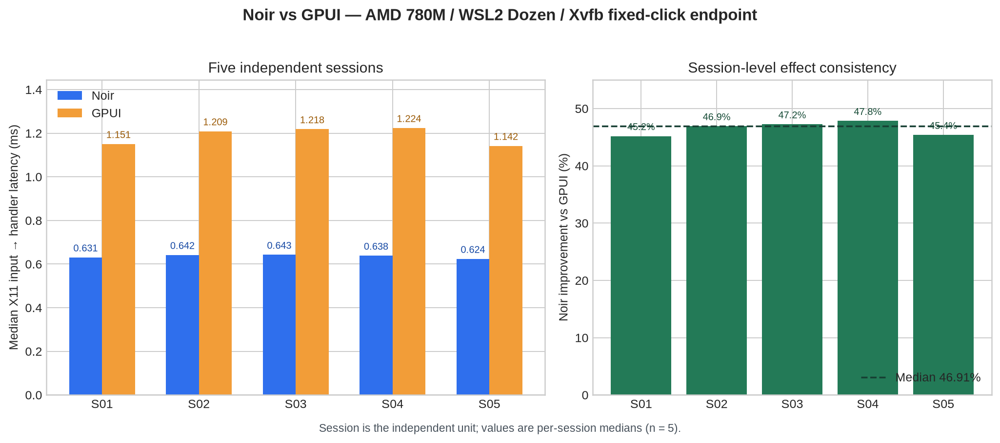

# Noir vs GPUI 确认性重跑：数据审计与结论边界

**审计对象：** `data/rigorous-20260815-221938`  
**审计方法：** 原始 JSONL 重算、session-aware 分层 bootstrap、精确方向检验与采集脚本审阅  
**审计日期：** 2026-08-16

## 结论摘要

这批重跑数据为 Noir 的核心性能主张提供了**明显更强但仍受场景限制的证据**。在固定的 **AMD Radeon 780M + WSL2 + Mesa Dozen + Vulkan + Xvfb** 环境中，针对固定虚拟列表的 **X11 输入发出至处理器日志确认** endpoint，五个独立 session 的中位数均显示 Noir 快于 GPUI。以 session 为独立实验单位而不是把 1,000 个嵌套 batch 当作独立样本后，结果仍保持稳定：session 中位数改善范围为 **45.19%–47.83%**，中位改善为 **46.91%**。[1] [2]

> 可以严谨地说：**在该硬件、驱动、Xvfb 与固定点击基准端点下，Noir 对 GPUI 具有高度一致、幅度很大的性能优势。**
>
> 不能据此说：Noir 已在原生桌面、真实显示器 input-to-photon、滚动、渲染吞吐、所有 GUI 场景或所有 GPU 上全面优于 GPUI。



## 已核验的实验完整性

数据目录记录了 5 个 session、每个 framework 每 session 200 个测量 batch，以及每 batch 25 次点击；这对应每个框架 1,000 个记录。执行日志显示五次 session 均完成 `200/200` Noir 与 `200/200` GPUI batch，并完成 50 个预热 batch；审计未发现 `incomplete-batches.jsonl`。[1] [3]

| 审计项目 | 结果 | 含义 |
|---|---:|---|
| 声明 / 发现的 session | 5 / 5 | session 记录齐全。 |
| 每 session、每框架 batch | 200 / 200 / 200 / 200 / 200 | 无缺失 batch。 |
| incomplete batch 记录 | 0 | 新加入的失败保护没有报告未完成批次。 |
| 区组内记录 | 每对 batch ID 相邻 | Noir 与 GPUI 可按同一 block ID 配对审计。 |
| Noir 先执行区组数 | 102、101、95、97、105 | 总计 500/1,000，实际顺序平衡。 |
| 二进制指纹组合 | 1 | 所有 session 使用同一 Noir / GPUI SHA-256 组合。 |

采集脚本确实为每一测量 block 随机交替 Noir 与 GPUI，而原始 `batch_id` 允许重建该顺序。因此，运行随时间漂移带来的简单顺序偏倚在此数据中没有表现为某个 framework 总是先运行。[3] [4]

## 以 session 为单位的主要结果

仓库原始 `analysis-results.json` 的 46.74% 值可复现，但其 Wilcoxon、t-test 与 bootstrap 都把 1,000 个 batch 池化，隐含把同一 session 内相关 batch 当作独立观测。由于实验只有 5 个独立 session，这些 batch-level p 值应是**描述性/敏感性证据，而不应作为主要推断证据**。[5]

本审计改以 session 为独立单位：先计算各 session 内两框架的中位数，再以“重采样 session、随后重采样该 session 的 batch”的两阶段 bootstrap 给出区间。这样既保留每个 session 内的采样不确定性，也不会把 1,000 batch 错当成 1,000 次独立重复。[6]

| Session | Noir 中位数 (ms) | GPUI 中位数 (ms) | Noir − GPUI (ms) | Noir 改善 |
|---|---:|---:|---:|---:|
| session-01 | 0.631 | 1.151 | −0.520 | 45.19% |
| session-02 | 0.642 | 1.209 | −0.567 | 46.91% |
| session-03 | 0.643 | 1.218 | −0.576 | 47.24% |
| session-04 | 0.638 | 1.224 | −0.585 | 47.83% |
| session-05 | 0.624 | 1.142 | −0.518 | 45.38% |

五个 session 全部同向支持 Noir。session 中位改善的中位数是 **46.91%**，算术均值为 **46.51%**；两阶段 bootstrap（50,000 次、固定种子）给出 Noir−GPUI 中位差的 95% 区间 **[−0.580, −0.526] ms**，以及相对改善的 95% 区间 **[45.49%, 47.59%]**。[6]

| 统计口径 | 结果 | 正确解释 |
|---|---:|---|
| 池化 batch 中位数 | Noir 0.636 ms；GPUI 1.194 ms；改善 46.74% | 与原始报告一致，但只能描述这1,000个嵌套batch。 |
| Session 中位改善 | 46.91% | 五个独立运行的典型效应。 |
| 分层 bootstrap 95% CI | 45.49%–47.59% | 在这五个session及其内部batch采样下，效应方向和规模稳定。 |
| 单侧精确方向检验 | `p = 0.03125` | 只有在“**Noir更快**”方向事前固定时才可用作0.05阈值证据。 |
| 双侧精确方向检验 | `p = 0.06250` | 若没有事前固定方向，5个独立session不足以跨越双侧0.05阈值。 |

这一区分很重要：结果并没有因修正伪重复问题而消失；相反，效应在五个独立 session 中高度一致。但独立单位仅为 `n=5`，因此应避免引用批级 `p≈10⁻¹⁶³` 来表达主证据强度，也应避免声称已经完成无条件的双侧显著性确认。

## 尾部行为与用户可感知含义

每个 batch 的数值是 25 次点击的总耗时除以 25，而非逐事件计时；因此 P95/P99 是**batch-平均 handler 时间**的尾部，而不是单次用户手势的端到端延迟分布。尽管如此，五个 session 中 Noir 的 P95 均低于 GPUI；session-03 的 Noir P95 为 1.257 ms，明显高于其自身中位数 0.643 ms，说明仍存在调度噪声或偶发尖峰，不能把中位数优势误写成“无尾部风险”。[6]

对 Noir 的框架战略而言，这个结果正好支持当前方向：对固定容量虚拟列表、预编译状态/action/几何与固定 GPU 写入范围，运行时最短路径的收益已能在真实 AMD 780M 的 Dozen/Vulkan 路径中稳定显现。它是“**编译型局部更新架构在此 endpoint 有效**”的证据，不是所有 UI 工作负载的普适定理。

## 仍存在的审计与外推限制

虽然二进制 SHA-256 和 git commit 被记录并保持一致，但环境元数据尚不能达到强可审计标准。五个 `session-XX-env.json` 文件都在 `adapter.probe_output` 内写入了未转义换行，因此严格说不是有效 JSON；适配器探测也没有得到有效 GPU 字符串，而 CPU governor 与电源状态都记录为 `unknown`。[4] 这不改变原始 latency 数值，却降低了未来第三方完全复现环境的可靠性。

| 限制 | 对当前结论的影响 | 下次实验的最小修复 |
|---|---|---|
| adapter probe 失败；环境 JSON 无效 | 不能从session元数据独立确认实际adapter。 | 用专门的无窗口 `noir_wgpu_probe` 输出转义后的JSON。 |
| CPU governor / power state 未记录 | 不足以排除功耗/调度配置影响。 | 显式记录 governor、AC/电池、温度与后台负载。 |
| Xvfb + WSL2 Dozen | 外推不到原生 Linux、Windows 或 macOS。 | 至少增加原生 Linux Vulkan 与另一真实 GPU。 |
| endpoint 为 X11 input → handler 日志 | 不含 present / compositor / display scan-out。 | 增加 GPU timestamp、present 与 input-to-photon 分层实验。 |
| 固定点击虚拟列表 | 不代表滚动、文本重排、复杂布局或动态绘制。 | 增加相同数据集的滚动、append-batch 和渲染损伤路径。 |
| 只有五个独立session | 支持方向性证据，双侧检验尚未小于0.05。 | 预注册方向后增加到至少10个跨日session；或预注册双侧检验并增加session数。 |

## 建议的结论措辞

建议把公开结论改为以下版本：

> 在 AMD Radeon 780M、WSL2 Dozen、Vulkan 和 Xvfb 的固定虚拟列表点击 endpoint 中，Noir 相对 GPUI 的 session 中位 handler 时间改善为 **46.91%**；5/5 独立 session 同向，session-aware 两阶段 bootstrap 95% 区间为 **45.49%–47.59%**。该结果证明 Noir 当前的预编译局部更新路径在该受控 endpoint 上具有稳定优势，但不代表原生显示、input-to-photon、滚动或通用 GUI 性能结论。

这是一个比“46.7% 更快”更值得保留的学术表述：它保留强效应与可复现性，又明确不把有限环境的实验扩大为不受支持的通用断言。

## 复现入口

```bash
# 仓库原始分析（固定 NumPy 1.26.4、SciPy 1.11.4）
bash tools/verify_analysis_reproducibility.sh data/rigorous-20260815-221938

# 本审计的session-aware复算与可视化
python3 tools/audit_confirmatory_rerun.py data/rigorous-20260815-221938
python3 tools/plot_session_aware_audit.py \
  data/rigorous-20260815-221938/session-aware-audit.json \
  data/rigorous-20260815-221938/session-aware-median-comparison.png
```

## References

[1]: global-env.json "确认性重跑协议与环境记录"
[2]: analysis-results.json "仓库原始的池化统计结果"
[3]: progress.log "五个session的执行、预热与完整batch计数"
[4]: ../../tools/rigorous_benchmark.sh "采集、交替区组、失败保护与环境记录实现"
[5]: ../../tools/analyze_rigorous_benchmark.py "仓库原始统计脚本：对batch的池化分析"
[6]: session-aware-audit.json "本审计基于原始JSONL的session-aware重算产物"
